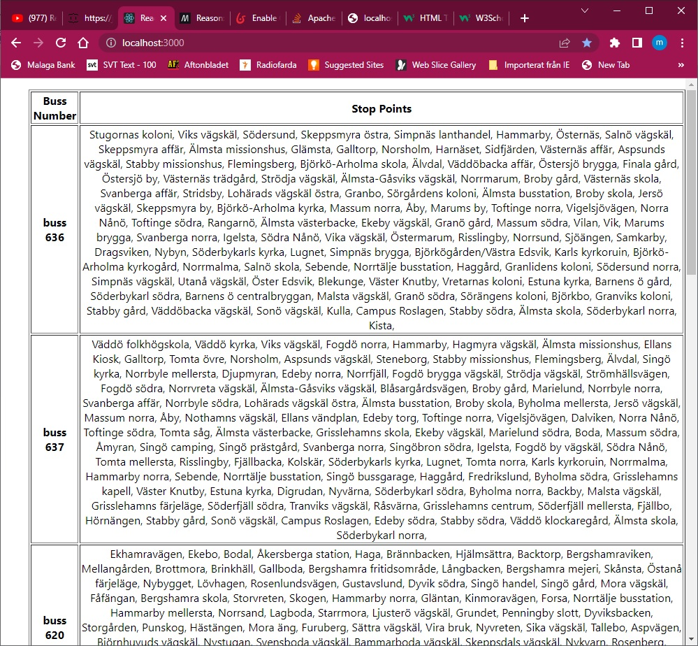

# trafik-restserver-react-front
för att kunna visa top-10 busslinjer 

-backend delen är Rest-API-server som körs i Tomcat-9 och Java som programspråk
-fronten i ReactJS med Redux som hjälplibrary

server byggs med:
   "mvn install"
och klineten med 
  "npm install". 
Man kör sedan klienten med "npm start"

back end anropas ==>  http://localhost:8080/TrafikREST/rest/stationer

koden är:
@Path("/stationer")
public class BusStationRS {
	@GET
	@Produces(MediaType.APPLICATION_JSON)
	public String getTable() throws Exception {
		Fetcher fetcher = new Fetcher();
		return fetcher.getTopTenStation();
	}
}
Java klassen Fetcher.java kan också köras för att få fram resultatet.

front==>  http://localhost:3000

 (JavaScripten är mycket liten och enkelt..)

import React, { useEffect, useState } from "react";
import axios from 'axios'

function Fetcher(){
   const [posts, setPosts] = useState([])
  useEffect(() => {
     axios.get('http://localhost:8080/TrafikREST/rest/stationer')
     .then(res => {
     console.log(res)
     setPosts(res.data)
     })
     .catch(err => {
     console.log(err)
    })
 },[])
 return (
  

     <ul>
	 <table border="1"><tr><th>Buss Number</th><th>Stop Points</th></tr>
      {posts.map (post => (
       
		<tr  key={post.busNumber}><th>buss {post.busNumber}</th><td>{post.Stationer}</td></tr>
      ))}
	   </table>
     </ul>
   

  )
}

----------

 korningResult.jpg
